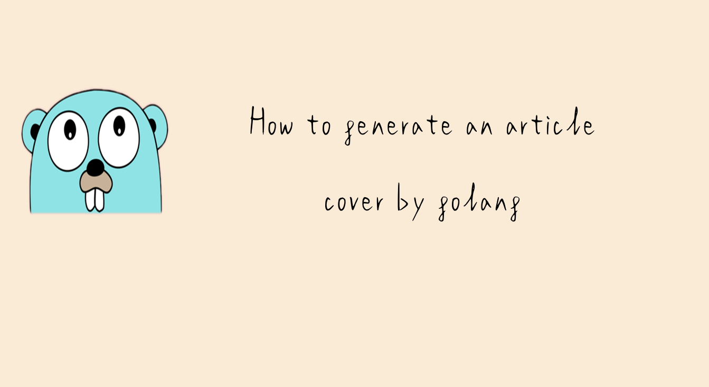

Cogen is an automatic article cover generation tool, which can generate article covers according to requirements after
configuring relevant options.

## Installation

To install this package, you need to install Go and set your Go workspace first.

1. You first need [Go](https://golang.org/) installed, then you can use the below Go command to install Cogen.

```sh
go get -u github.com/LgoLgo/cogen
```

2. Import it in your code:

```go
import "github.com/LgoLgo/cogen"
```

## Example

```go
package main

import "github.com/LgoLgo/cogen"

func main() {
	cogen.CoverGen(
		cogen.WithTitle("How to generate an article cover by golang"),
		cogen.WithImagePath("example/gopher.png"),
		cogen.WithFontFilePath("font/zads.ttf"),
		cogen.WithFontRGB([]int{0, 0, 0}),
		cogen.WithCoverRGB([]int{250, 235, 215}),
		cogen.WithFontSize(100),
	)
}
```

**Output**



## Options

| Option         | Default              | Description                                                                                                                      |
|----------------|----------------------|----------------------------------------------------------------------------------------------------------------------------------|
| Title          | LgoLgo               | Title sets article title.                                                                                                        |
| SavingFileName | LgoLgo               | SavingFileName sets file name.                                                                                                   |
| FontFilePath   | font/syqh.ttf        | FontFilePath sets font file path. There are other fonts in the font folder. If you need to use them, just configure their paths. |
| ImagePath      | LgoLgo.png           | ImagePath sets image path. The image will appear on the left side of the cover.                                                  |
| CoverRGB       | []int{47, 54, 66}    | CoverRGB sets cover's RGB255.                                                                                                    |
| FontRGB        | []int{238, 241, 247} | FontRGB sets font's RGB255.                                                                                                      |
| FontSize       | 76                   | FontSize sets font size.                                                                                                         |
| DPI            | 72                   | DPI sets font's DPI.                                                                                                             |
| LineSpacing    | 1.1                  | LineSpacing sets line spacing.                                                                                                   |
| Width          | 1343                 | Width sets cover width.                                                                                                          |
| ResizeWidth    | 1000                 | ResizeWidth sets image width.                                                                                                    |
| MaxWordWidth   | 660.0                | MaxWordWidth sets max word's width.                                                                                              |
| Height         | 734                  | Height sets height.                                                                                                              |
| ResizeHeight   | 500                  | ResizeHeight sets image height.                                                                                                  |
| X              | 800.0                | X sets font's X coordinate.                                                                                                      |
| AX             | 0.5                  | AX sets font's AX.                                                                                                               |
| AnchoredX      | 200                  | AnchoredX sets image's X coordinate.                                                                                             |
| AnchoredAX     | 0.5                  | AnchoredAX set image's AX.                                                                                                       |
| Y              | 300.0                | Y sets font's Y coordinate.                                                                                                      |
| AY             | 0.6                  | AY sets font's AY.                                                                                                               |
| AnchoredY      | 220                  | AnchoredY sets image's Y coordinate.                                                                                             |
| AnchoredAY     | 0.5                  | AnchoredAY set image's AY.                                                                                                       |

## License

This project is under the Apache License 2.0. See the LICENSE file for the full license text.